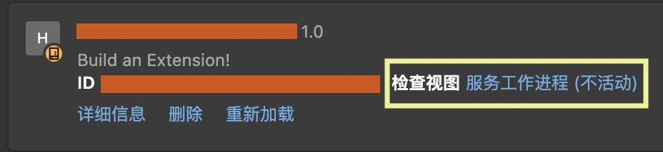

## 前言
写过 Chrome 扩展程序的朋友，一定被扩展程序不同脚本文件的 JS 上下文折磨过：*Content script*、*Background script*、popup 中的 script，到底有什么区别？其实这也不怪我们开发者，Chrome 的官方开发文档本来就没有在一个地方非常系统性的讲解和对比各个执行上下文的区别，并且（可能出于安全性考虑）故意“春秋笔法”，甚至有时候自己都没有统一一个叫法。当某一处写道：“你可以在你的扩展程序里面这么写”的时候，谁知道它指的是哪一种上下文？

在无数次的尝试和在 StackOverflow 的抽丝剥茧之后，我也终于能整理出这么一个详细的总结，详细讲讲不同上下文究竟有何异同。

> 注：本文基于撰写时最新的 [Chrome Extension Manifest v3](https://developer.chrome.com/docs/extensions/mv3/intro/) 版本。

## Popup UI 上下文
在官方文档的 [Getting Started](https://developer.chrome.com/docs/extensions/mv3/getstarted/) 中，就用到了作用于 popup 页面（即：点击右上角扩展图标弹出的页面）的`popup.js`、和用于设置界面的`option.js`。后者我没有用过，故不会在本文展开，但是我预测和此处即将讲的`popup.js`大体相同。

其实这一块较为直白。被`popup.html`（或者任何在`manifest.json`中被声明为 popup 页面的 HTML 文件）引用的脚本，都使用该 popup 页面的上下文。**其`document`和`window`属性都指向这个独立的 popup 页面。**
例如：`document`能读写这个小页面的 DOM，`window.location.href`也能拿到这个小页面的 URL（形如`chrome-extension://<扩展 ID>/popup.html`。**但是注意这个上下文里的`console`被隐藏起来了，故`console.log`等函数没有任何效果**，但也不会报错。

权限方面，显然这个上下文不能直接访问任何网页的环境。但是它可以访问`chrome.*`API（前提是在`manifest.json`里面声明了相关权限）。

## Background Script
官方 [Getting Started](https://developer.chrome.com/docs/extensions/mv3/getstarted/) 里面还用到了一个`background.js`。在 v3 版本中，Background Script 基于 service worker 运作，是一段按需加载、基于事件、拥有独立上下文的脚本。我们需要在`manifest.json`中声明`background.service_worker`字段来引入它们
```json
{
  "name": "My extension",
  "background": {
    "service_worker": "background.js"
  },
  ...
}
```

在`manifest.json`中声明为`background.service_worker`的脚本，**没有`document`和`window`变量，拥有独立的`console`**。它的`console`可以在 Chrome 扩展页面的“检查视图 服务工作进程”中看到。


常见的编程范式[^1]是，在 background script 中实现主要的业务逻辑，并且用`chrome.*.on*.addListener`的方式监听事件，调用相应的逻辑。

## Content Script
除了这几个官方迫不及待给你介绍的脚本上下文之外，还有一个经常被大家提起和用到，官方却藏着掖着的 [Content Script](https://developer.chrome.com/docs/extensions/mv3/content_scripts/#isolated_world)。我们有两种方式声明 Content Script：在`manifest.json`里面用`content_scripts[].js`里面直接声明整个文件
```json
{
 "name": "My extension",
 "content_scripts": [{
     "matches": [...],
     "css": ["my-styles.css"],
     "js": ["content-script.js"]
   }],
  ...
}
```
或者在任何能够访问`chrome.*`API 的上下文中（例如 Background Script 和 Popup UI 脚本中）调用 API 程序性注入
```js
// 当前 tab 的变量，多半是在 callback 或者 chrome.tabs.query 等函数返回值中拿到
chrome.scripting.executeScript({
  target: { tabId: tab.id },
  files: ['content-script.js'], // 可以注入整个文件
  func: function() {document.body.style.color='red'} // *或者*一段函数
});
```
新版似乎还有`registerContentScripts`、`insertCSS`等函数，以及对应将已经注入的脚本撤下的函数。

程序性注入时要注意以下几点
* 新版 API 的官方 Reference 中，注入函数应使用`func`字段[^2]。但是官方文档很多地方用的是`function`[^3]。亲测截至本文撰写时，这两个字段都可以使用。但是如果使用 Typescript，`@types/chrome`根据官方 API Reference 撰写，故并没有采纳后者。
* `files`和`func`字段只能二选一。上文因为精简需要同时展示出来了。
* `func`字段的函数中，出现的`document`、`console`等变量将是 Content Script 的变量。
* 同时在`manifest.json`中需要声明`activeTab`这一`permission`，或者对指被注入站点的`host_permission`[^3]

至于 Content Script 的上下文，是和 Background Script、Popup 等 UI Script、以及 Page Script（网页自己的 JS 上下文）都不同的另一个隔离环境[^4]。但是 Content Script 的好处在于**它和网页本身共享一些全局变量，包括`document`、`console`，以及`window`的部分方法（例如 `window.postMessage`）**，虽然官方好像并没有明确列出所有共享的变量。同时它**能访问部分`chrome.*`API**[^3]。
同时`chrome.scripting.executeScript`这一函数又有一个官方基本没提到过的字段`world={ISOLATED|MAIN}`，我尚未尝试，但是或许可以绕过限制、完完全全注入到 Page Script 的上下文中？

官方文档在藏的比较深的地方讲到，Content Script 比 Background Script 安全性稍差，出入 Content Script 的数据可能会被黑客恶意截胡[^5][^6]。

## Page Script
这是最后一个官方不会讲，但是 Stack Overflow 上面经久不衰的一个话题，即页面 JS 脚本自己的上下文。虽然 Content Script 能完成大部分页面编辑的需求（通过`document` 和 `windows`），但是如果我们想访问网页脚本定义的其他全局变量， Content Script 就无能为力了。

虽然官方没有正式给这种脚本起名，但是本文使用 Page Script 称呼，顾名思义就是注入到页面 JS 所在的上下文了。Chrome 官方出于各种考虑没有提供对应的API。抛开上面提到的`world`参数，目前 v3 版本能用的一种注入方法如下[^7]：

为要注入的代码单独创建一个 JS 文件，借助 Content Script 能访问`document`的力量注入`<script>`脚本。在 Content Script 中执行如下代码
```js
var s = document.createElement('script');
s.src = chrome.runtime.getURL('script.js');
s.onload = s.remove.bind(s);
(document.head || document.documentElement).appendChild(s);
```
同时想让 Content Script 能访问到这个 `script.js` 文件，需要在`manifest.json`中声明如下权限
```json
{
  "name": "My extension",
  "web_accessible_resources": [{
    "resources": ["script.js"],
    "matches": [...]
  }],
  ...
}
```

类似的，另一种网上经常能见到、**但是在新版本 Chrome 中已经失效的方法是**，直接把要注入的脚本内容写在 Content Script 里面：
```js
const codeToInject = `console.log('Hello')`
var s = document.createElement('script');
s.textContent = codeToInject;
s.onload = s.remove.bind(s);
(document.head || document.documentElement).appendChild(s);
```
失败的原因是新版的 Chrome 默认禁止网页随意执行`<script>...</script>`的代码块和`<script src="不在Content Security Policy白名单" />`的外部代码。

## 写在最后
写这篇文章的目的，其实是为了另一篇文章做铺垫。在那篇文章里我会详细总结 Chrome 扩展程序各个 JS 上下文的通信方式。那篇文章究竟什么时候能填坑呢？敬请期待！

## 参考
[^1]: [Manage events with service workers](https://developer.chrome.com/docs/extensions/mv3/service_workers/)
[^2]: [API Reference: chrome.scripting](https://developer.chrome.com/docs/extensions/reference/scripting/#method-executeScript)
[^3]: [Content scripts](https://developer.chrome.com/docs/extensions/mv3/content_scripts/)
[^4]: [Content scripts: Work in isolated worlds](https://developer.chrome.com/docs/extensions/mv3/content_scripts/#isolated_world)
[^5]: [Content scripts: Stay secure](https://developer.chrome.com/docs/extensions/mv3/content_scripts/#security)
[^6]: [Stay secure: Use content scripts carefully](https://developer.chrome.com/docs/extensions/mv3/security/#content_scripts)
[^7]: [Use a content script to access the page context variables and functions](https://stackoverflow.com/questions/9515704/use-a-content-script-to-access-the-page-context-variables-and-functions)
